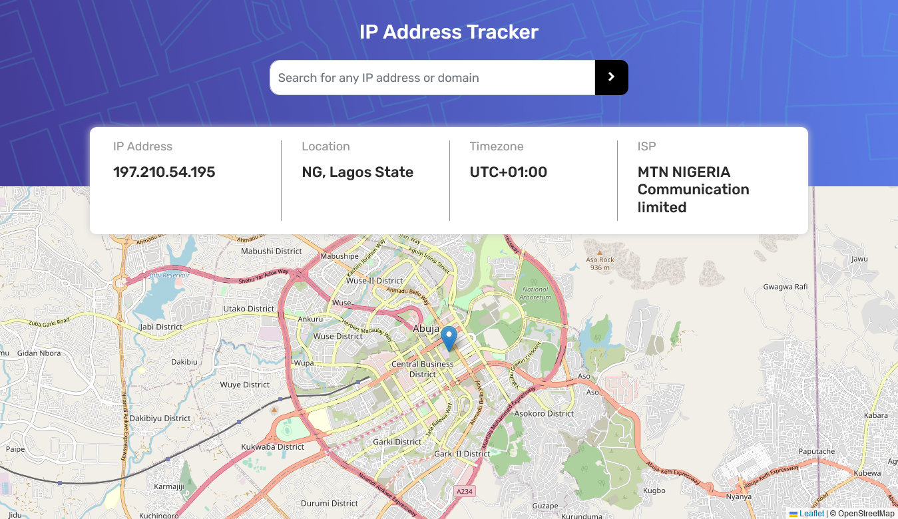
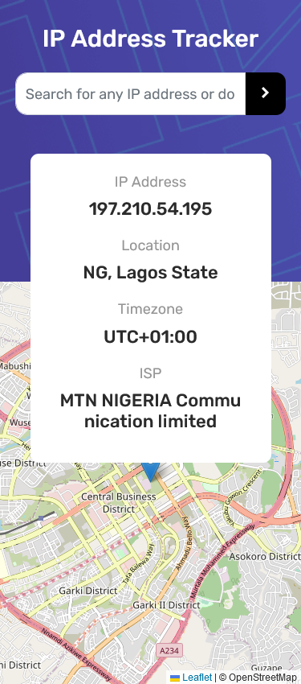

# Frontend Mentor - IP address tracker solution

This is a solution to the [IP address tracker challenge on Frontend Mentor](https://www.frontendmentor.io/challenges/ip-address-tracker-I8-0yYAH0). Frontend Mentor challenges help you improve your coding skills by building realistic projects.

## Table of contents

- [Overview](#overview)
  - [The challenge](#the-challenge)
  - [Screenshot](#screenshot)
  - [Links](#links)
- [My process](#my-process)
  - [Built with](#built-with)
  - [What I learned](#what-i-learned)
  - [Continued development](#continued-development)
  - [Useful resources](#useful-resources)
- [Author](#author)
- [Acknowledgments](#acknowledgments)

## Overview

### The challenge

Users should be able to:

- View the optimal layout for each page depending on their device's screen size
- See hover states for all interactive elements on the page
- See their own IP address on the map on the initial page load
- Search for any IP addresses or domains and see the key information and location

### Screenshot

### Links

- Solution URL: [github repo](https://github.com/Kingsleyaham/Ip-Address-Tracker)
- Live Site URL: [ip address tracker](https://kingsleyaham.github.io/Ip-Address-Tracker/)

## My process

### Built with

- Semantic HTML5 markup
- CSS custom properties
- Bootstrap 5
- Javascript

### Continued development

I want to focus more on the Mern stack and also possibly use Next Js in future projects

## Author

- Linkedin - [@kingsley-aham-282a51225](https://www.linkedin.com/in/kingsley-aham-282a51225/)
- Frontend Mentor - [@Kingsleyaham](https://www.frontendmentor.io/profile/Kingsleyaham)
- Twitter - [@aham_kingsley8](https://twitter.com/aham_kingsley8)
